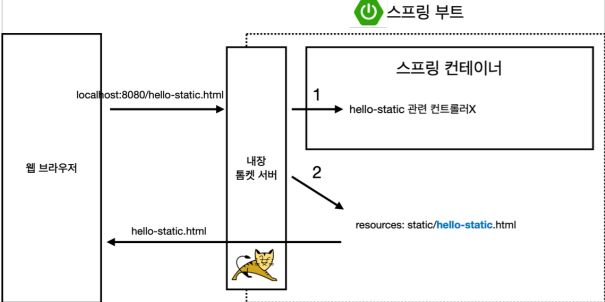

# 스프링 웹 개발 기초

크게 웹을 개발한다는 3가지 방법

1. [정적 컨텐츠](https://www.notion.so/26454c55454b4d9fa1ba9080f16bed88) 
2. [MVC와 템플릿 엔진](https://www.notion.so/26454c55454b4d9fa1ba9080f16bed88)
3. [API](https://www.notion.so/26454c55454b4d9fa1ba9080f16bed88)

## 정적 컨텐츠

- 파일을 그대로 웹브라우저에 전달
- 스프링 부트 정적 컨텐츠 기능
- [https://docs.spring.io/spring-boot/docs/2.3.1.RELEASE/reference/html/spring-boot-features.html#boot-features-spring-mvc-static-content](https://docs.spring.io/spring-boot/docs/2.3.1.RELEASE/reference/html/spring-bootf)

```html
<!DOCTYPE HTML>
<html>
<head>
 <title>static content</title>
 <meta http-equiv="Content-Type" content="text/html; charset=UTF-8" />
</head>
<body>
정적 컨텐츠 입니다.
</body>
</html>
```

### 정적 컨텐츠 이미지



## MVC와 템플릿 엔진

- 가장 많이 쓰는 방식으로 과거의 jsp, php(템플릿엔진)  html을 그냥 주는것이 아닌 서버에서 프로그래밍 해서 html을 동적으로 보내주는 방식
- MVC : Model, View, Controller

```java
@Controller
public class HelloController {
 @GetMapping("hello-mvc")
 public String helloMvc(@RequestParam(name = "name" [default : required = true]) String name, Model model) {
 model.addAttribute("name", name);
 return "hello-template";
 }
}
```

required 의 기본 값은 true이므로 기본적으론 값을 넘겨야 한다.

- [http://localhost:9090/hello-mvc?name=](http://localhost:9090/hello-mvc?name=spring)[name]

```html
<html xmlns:th="http://www.thymeleaf.org">
<body>
<p th:text="'hello ' + ${name}">hello! empty</p>
</body>
</html>
```

### MVC, 템플릿 엔진 이미지


- `viewResolver` : 화면과 관련된 해결사 (View를 찾아주고 template engine에 연결)

## API

- JSON(데이터 구조 포맷)으로 클라이언트에게 데이터를 전달하는 방식

**@ResponseBody 문자 반환**

```java
@GetMapping("hello-string")
    @ResponseBody // http에서 body부에 이 데이터를 직접 넣어주겠다.
    public String helloString(@RequestParam("name") String name) {
        return "hello" + name; // hello spring : 적은 문자열이 그대로 내려감
    }
```

- `@ResponseBody` 를 사용하면 뷰 리졸버( viewResolver )를 사용하지 않음
- 대신에 HTTP의 BODY에 문자 내용을 직접 반환(HTML BODY TAG를 말하는 것이 아님)

**실행**

- [http://localhost:8080/hello-string?name=spring](http://localhost:8080/hello-string?name=spring)

**@ResponseBody 객체 반환**

```java
// Data를 내놔라 (API 방식)
    @GetMapping("hello-api")
    @ResponseBody
    public Hello helloApi(@RequestParam("name") String name){
        Hello hello = new Hello();
        hello.setName(name);
        return hello;
    }

    // helloController.Hello 형태로 사용 가능
    // 클래스 안에서 클래스를 또 사용 하는 방법
    // java에서 정식으로 지원하는 문법
    @Getter
    @Setter
    static class Hello {
        private String name;
    }
```

- `@ResponseBody` 를 사용하고, 객체를 반환하면 객체가 JSON으로 변환됨

**실행**

- [http://localhost:8080/hello-api?name=spring](http://localhost:8080/hello-api?name=spring)


JSON : {”Key” : “Value”}

**@ResponseBody 사용 원리**


- `@ResponseBody` 를 사용
    - HTTP의 BODY에 문자 내용을 직접 반환
    - `viewResolver` 대신에 `HttpMessageConverter`가 동작
    - 기본 문자처리: `StringHttpMessageConverter`
    - 기본 객체처리: `MappingJackson2HttpMessageConverter`
    - byte 처리 등등 기타 여러 `HttpMessageConverter`가 기본으로 등록되어 있음

> 참고: 클라이언트의 HTTP Accept 해더와 서버의 컨트롤러 반환 타입 정보 둘을 조합해서
`HttpMessageConverter` 가 선택된다. 더 자세한 내용은 스프링 MVC 강의에서 설명하겠다
>