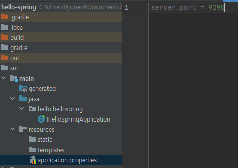

# 프로젝트 환경 설정 1

port 번호 바꾸는 방법 : [application.properties](http://application.properties) → sever.port = 포트번호

## 라이브러리 살펴보기

> Gradle은 의존관계가 잇는 라이브러리를 함께 다운로드 함
> 

### 스프링 부트 라이브러리

- spring boot-starter-web
    - spring-boot-starter-tomcat : 톰캣(웹서버)
    - spring-webmvc:스프링 웹 MVC
- spring-boot-starter-thymeleaf:타임리프 템플릿 엔진(View)
- spring-boot-starter(공통) : 스프링 부트 + 스프링 코어 + 로깅
    - spring-boot
        - spring-core
    - spring-boot-starter-logging (현직에서는 system.out.println대신 logging을 쓴다.)
        - logback, slf4j

### 테스트 라이브러리

- spring-boot-starter-test
    - junit : 테스트 프레임 워크 (Junit 4 → Junit5로 넘어가는 추세)
    - mockito : 목 라이브러리
    - assertj : 테스트 코드를 좀 더 편하게 작성하게 도와주는 라이브러리\
    - spring-test : 스프링 통합 테스트 지원